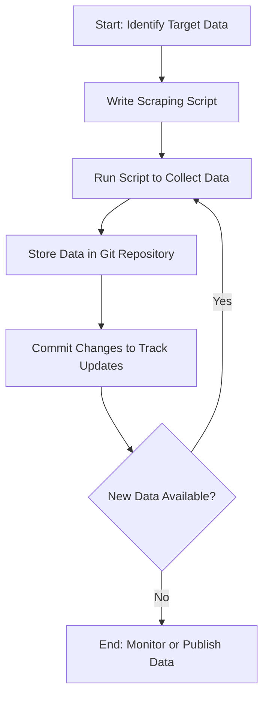

# Approach

## File Content
  - Download links for textbased files such as CSV, JSON, Markdown, RSS, ATOM, XML, etc. are easy to scrope with a bash one-liner
  - Easier to do an API Call, RSS Feed, or Static file over html pages, which often have a complicated structure or obfuscate data
## HTML pages
  - Some webpages are full of adtech and CDN tags, which constantly change, seperate from the content - this generates false positives in the gitdiff if you just fetch a full page's html
    - Using [Markdownify](https://pypi.org/project/markdownify/) to convert the HTML to Markdown is an option to have a simplified version of the content insted of the complete markup/  

## 💡Tips for Canada.ca Specificly :
  - Watch specifically for the CRSF token and the Akamai Boomerang
  - Example:   
    - CRSF: `<meta name="_csrf_token" content="ImYyZDZhMjBiZWEwNzFkYWZkMGU5ODViYjMwMjIzOGIzOTRhZjA2OGIi.Z41oGw.hx-r3ZcKQW_DoydDr1GHWIVNRJY" />`
    - Boomerang: `<script>!function(a){var e="https://s.go-mpulse.net/boomerang/",t="addEventListener";...` Will be a block of script

  

## Process

### Diagram

### Description

Start: The process begins with identifying the target data (e.g., websites, APIs, or files). 

Write Scraping Script: A script is created to automate data collection.

Run Script: The script is executed to fetch and collect data.

Store Data in Git: The scraped data is stored in a Git repository.

Commit Changes: Data updates are committed to maintain version history.

Decision Point: Checks if new data is available.

If "Yes," the script runs again to fetch the new data.

If "No," the process ends, with the data monitored or published for use.
